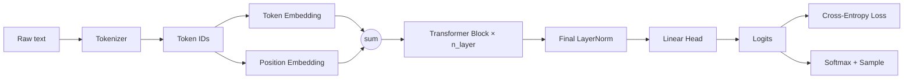

# HYPER PARAMS

| Hyperparameter | Your value | What it controls | Why it matters |
|---|---|---|---|
| `batch_size` | 64 | # independent sequences processed per step | Bigger → more stable, less noisy gradient estimates, but more memory/compute per step. Smaller → noisier gradients (sometimes a mild regularizer) but faster steps; too small and training gets unstable. |
| `block_size` | 256 | max context length (tokens the model can look back on) | Bigger → captures longer-range dependencies, but attention cost grows quadratically with sequence length (every token attends to every other token), so memory/compute scale badly with it. |
| `learning_rate` | 3e-4 | step size for each gradient update | Too high → loss diverges, oscillates, or goes NaN. Too low → training crawls or gets stuck. Transformers are notably sensitive to this (your own comment notes it was lowered specifically for attention). |
| `max_iters` | 5101 | total training steps | Just a compute budget — needs to be enough for loss to converge without wasting compute or drifting into overfitting. |
| `eval_interval` | 300 | how often you check validation loss | Purely a monitoring cadence — doesn't affect training itself, just how often you get a readout. |
| `eval_iters` | 200 | batches averaged per evaluation | More batches → less noisy loss estimate, at the cost of evaluation time. |
| `n_embd` | 384 | width of each token's vector — the model's "width" | Bigger → more capacity to represent complex features, but more parameters, more compute, and more overfitting risk on small datasets. |
| `n_head` | 6 (defined, **not actually used** — see note) | number of parallel attention heads | More heads → more distinct relationship types learned in parallel, but each head gets a smaller slice of the embedding to work with (`head_size = n_embd // num_heads`). |
| `n_layer` | 6 | number of stacked Transformer blocks — the model's "depth" | More layers → more capacity for hierarchical, abstract representations, but harder to train (mitigated by residuals + norm), more compute, more overfitting risk. |
| `dropout` | 0.2 | fraction of activations zeroed during training | Higher → stronger regularization (less overfitting) but can underfit if too high. |
| `vocab_size` | derived from `input.txt` | # distinct tokens | Sets the size of the token embedding table and `lm_head`; not really "tuned," just a consequence of your tokenizer and data. |

# 1.  Tokenization

A neural net only understands numbers, so raw text first has to become a sequence of integers — that's tokenization, its done in the tokenizer which is a completely
seperate model from the LLM

Trade-off between three approaches:

    Character-level: tiny vocab (usually under 100), so the embedding table and output layer (lm_head) stay small. Downside: sequences get long — "hello" is 5 tokens — 
    so the model has to work harder across more steps to capture meaning that spans many characters.

    Word-level: one token per word. Shorter sequences, more meaning packed per token — but vocab explodes (hundreds of thousands of words), 
    and you hit the out-of-vocabulary problem: any word not seen during training simply has no ID.

    Subword / BPE (what GPT-2/3/4 actually use): a middle ground. Byte-Pair Encoding starts from individual characters and iteratively merges the most frequent
    adjacent pairs into new tokens, building a vocab of roughly 50k common chunks — whole words, word-pieces, prefixes. Frequent words become one token; 
    rare or unseen words fall back to smaller known pieces, so there's no true OOV problem, and sequences stay much shorter than character-level.

vocab_size directly sets the size of token_embedding_table and lm_head — a bigger vocab means more parameters in exactly those two places. Every other component in 
the model is agnostic to how you tokenized.

# 2. Embedding

A token ID (say, 7) is just a label with no built-in notion of meaning or similarity. Embeddings map each ID to a learned vector, so relationships between 
tokens can be represented as geometric relationships between vectors. We have 2 main types of embeddings:

```python
self.token_embedding_table = nn.Embedding(vocab_size, n_embd)
self.positional_embedding_table = nn.Embedding(block_size, n_embd)

tok_emb = self.token_embedding_table(idx)                                   # what the token is
pos_emb = self.positional_embedding_table(torch.arange(T, device=device))   # where it is
x = tok_emb + pos_emb
```

Self-attention has no built-in sense of order — without positional information, "the cat sat" and "sat the cat" look identical to it, since it sees a set of tokens,
not a sequence. Adding a position vector on top of the token vector lets the model recover where each token sits.

# 3. Hidden Layers

Any layer sitting between input and final output, stacking a lot on top leads to a network that understands more.

However, we cant just stack linear functions on top of eachother, we need some non linearity to actually add some depth to our computations.

Hidden Layer structure is just: linear → non-linearity → linear (→ non-linearity → ...).

`y = W2(W1x + b1) + b2 = (W2W1)x + (W2b1 + b2)`  

# 4. Transformers

Thousands of Attention Block -> FeedForward

## 1. Self Attention

Attention blocks are how tokens share information with each other, this block is the only part where a token interacts with another token.
Masking the act of mkaing sure that the previous tokens cant communicate with the feature and let the LLM cheat.

We have our own key and value weights that the model also trains, where then we multiply our input with these weights and obtain our key-query pairs, where queries are what 
a token wants, "Is there any nouns?" and keys being what each token can bring, "I am a noun!". Where then we take the dot product of this table we created of key and queries
then mask the result, (make upper triangle 0) then we get our "attention score" where we then multiply with our input again to get our output which is now changed via the context
of the other tokens.

A single head can only learn one thing at a time, so we run several heads in paralel. Running in multiple other attention block.

```python
self.register_buffer('tril', torch.tril(torch.ones(block_size, block_size)))
# A single head

k = self.key(x)     # (B, T, head_size)
q = self.query(x)   # (B, T, head_size)
wei = q @ k.transpose(-2, -1) * C**-0.5     # (B, T, T) — every query dotted with every key
wei = wei.masked_fill(self.tril[:T, :T] == 0, float('-inf'))
wei = F.softmax(wei, dim=-1)
wei = self.dropout(wei)
v = self.value(x)
out = wei @ v

# Multihead

self.heads = nn.ModuleList([Head(head_size) for _ in range(num_heads)])
self.proj = nn.Linear(num_heads * head_size, n_embd)

def forward(self, x):
    out = torch.cat([h(x) for h in self.heads], dim=-1)
    out = self.proj(out)

```

## 2. FeedForward

Feedworward is the part of the transistor where every token is processed independantly (its just an MLP after the attention block)

```python
class FeedForward(nn.Module):
    def __init__(self, n_embd):
        super().__init__()
        self.net = nn.Sequential(
            nn.Linear(n_embd, 4 * n_embd), # 4x from paper
            nn.ReLU(),
            nn.Linear(4 * n_embd, n_embd),
            nn.Dropout(dropout)
        )
    def forward(self, x):
        return self.net(x)
```
## 3. Residual Connections

This isnt part of the transformer, but its kinda how we process a transformer, instead of just assigning x to the outputs from the attention-> transformer, we add them up.

```python
mean = x.mean(dim=-1, keepdim=True)
var = x.var(dim=-1, keepdim=True)
x_norm = (x - mean) / torch.sqrt(var + eps)
out = gamma * x_norm + beta
```

## Full Block of Transformer

```python
class Block(nn.Module):
    def __init__(self, n_embd, num_heads):
        super().__init__()
        head_size = n_embd // num_heads
        self.sa = MultiHeadAttention(num_heads, head_size)
        self.ffwd = FeedForward(n_embd)
        self.ln1 = nn.LayerNorm(n_embd)
        self.ln2 = nn.LayerNorm(n_embd)

    def forward(self, x):
        x = x + self.sa(self.ln1(x))
        x = x + self.ffwd(self.ln2(x))
        return x
```

# 5. Normalization

## 1. BatchNorm

Normalize each feature across the batch. (The batch norm downsides gets clamped by LayerNorm as it focuses on a single tokens vector.


## 2. LayerNorm

For each token's independantly, rescale mean = 0 / variance = 1 then apply a learned scale (gamma) and shift (beta) across the feature dimension.
```python
nn.LayerNorm(n_embd)
```

## 3. Pre Norm vs Post Norm

```python
x = x + self.sa(self.ln1(x))     # norm BEFORE the sublayer — pre-norm
x = x + self.ffwd(self.ln2(x))   # norm BEFORE the sublayer — pre-norm
```
Post norming, residual path ITSELF gets normalized at every block, making the transformers unstable to train.
Modern transformers use pre norming, where we NEVER touch the residual path.

# 6. Regularization ( Dropout & Weight Decay & Optimizer )

## Dropout
Aims to lower overfitting via killing of some neurons.

During training, `nn.Dropout(p)` zeroes each activation with probability `p`, *and* scales the surviving activations by `1/(1-p)`. That scaling matters — it keeps the expected total magnitude the same whether 
dropout is active or not, so at evaluation time (`model.eval()`) dropout can simply switch off entirely (identity function) rather than needing a separate test-time correction.

## Weight Decay
**Weight decay** adds a penalty on the *size* of the weights to the loss:
```python
loss = normal_loss + (λ/2) * sum(w²)
```
Large weights let a model fit training data — including its noise — very precisely; penalizing their magnitude pushes the model toward smaller, smoother weights that tend to generalize better. `λ` (the `weight_decay` argument) controls the strength: too high and the model can't even fit the training data well (underfitting); too low and it does nothing.

# 7. Loss, Overfitting & Underfitting

Overfitting — train loss keeps dropping while val loss stalls or rises. The model is memorizing training-specific noise instead of general patterns. 

Underfitting — both train and val loss stay high and similar, and neither is dropping much. The model lacks capacity, hasn't trained long enough, or has too much regularization to even fit the training set properly.
